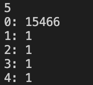

### Results
---
Overall, we were able to complete most of the goals we set out to, however we ran into some issues with the output of one of our algorithms
#### Leading Question
Our goal with the project was to create a recommendation tool that would output related topics given two inputted Wikipedia page titles. We were able to create the recommendation tool and generated resonably meaningful results (see "Example Results"). 

However, we were not able to use the strongly connected components algorithm to create a second recommendation tool taking in only one input like we'd hoped. The entire graph ended up being one large strongly connected component, showing the highly-interconnected nature of Wikipedia articles. Therefore, strongly connected components were not meaningful when trying to find related articles. 
#### Our deliverables
   * Our makefiles run as expected
   * We properly read in our wikipedia set and built a graph based on it
   * We have thoroughly tested our graph and algorithms for bugs and memory leaks
   * 2 Wikipedia page input - outputs pages related to both results with reasonable accuracy
   * 1 Wikipedia page - recommendations were too large to be useful
   * See Kosaraju's algorithm for more details	 
#### Algorithms & Traversals
   * Dataset trimming
      * Trimmed dataset from 4 million nodes and 100 million edges to top 24 thousand with highest in-degree
      * Ran BFS on three seed nodes, terminated two steps from seed
      * Filtered out discarded nodes and output adjacency list to file in CSV format with 15.5 thousand nodes and about 952 thousand edges
   * Used Brandes Betweeness Centrality algorithm to determine the betweeness centrality of each wikipedia page in the trimmed dataset
      * Output placed in CSV that can be loaded into a map to avoid expensive algorithm cost 
      * Used the CSV to get related article for 2 page input	 
   * Used Kosaraju's Algorithm to find all of the strongly connected components in the trimmed dataset
    	* Consisted of first finding the DFS traversal of the graph, then running DFS again on the transpose of the original graph in the order of the original DFS
    	* Output resulted in nearly the all nodes being strongly connected (15.2k nodes)
    	* This algorithm was therefore unable to provide us with any useful recommendation since nearly the entire dataset is strongly connected. We had originally wanted to identify small clusters of strongly connected nodes that would theoretically be highly related to each other.
#### Verification Tests
We created our own testing .txt files for verifying the functionality of the BFS, Brandes, and Kosaraju's algorithms. These simple tests were constructions of adjacency lists that could mathematically be quickly verified for their expected outputs and were compared to how our code performed these algorithms. The testing files that were used can be found here: [Here](https://github.com/zayaanali/cs225-final-project/tree/main/tests)

#### Future Directions
Some potential ways to improve our algorithm could be:
1. Have a stricter definition of an edge/make the graph weighted
   * Many Wikipedia articles that shouldn't be related are linked to each other, making results less accurate. Weighting the strength of the connection somehow or finding some method to reduce "bad" edges would improve the accuracy of our algorithm.
2. Identify clusters/themes
   * Originally, we'd hoped that identifying strongly connected components would give us groups of nodes that would all be related to a broader topic (i.e. all instruments would be under a "Music" strongly connected component).
   * Being able to identify clusters of nodes that trace back to a broader topic would greatly improve the relevance and usefulness of results. For example, when inputting "Beethoven" and "Mozart," our code will output "Violin", "Syphyllis", and "Alcoholism." While syphillis and alcoholism are technically related to both Beethoven and Mozart, it would be much more useful if the program could identify "Beethoven" and "Mozart" as composers and output music-related topics. 
   * One potential way to do this could be to focus on the nodes with extremely high betweenness centrality scores (see "Example results" for Brandes) and use them as umbrella topics to classify lower-ranked nodes. 
3. Text search/fuzzy matching
   * Currently, "related_topics_two_inputs" requires the inputs to be formatted exactly how they appear in the "finaltitles.txt" file.
   * It would be much more convenient if users could search for their query (i.e. entering "Beethoven" instead of "Ludwig van Beethoven")
4. Adding randomness
   * Our program will always return the same topics given the same inputs
   * This is not very practical since if the program were being used as a recommendation tool, it would work the first time but then be useless after the user reads the related articles.
   * Ideally, there would be some level of randomness to always find new related topics to keep the reader interested. 
#### Example Results:

**BFS**
The output of BFS was just the trimmed and parsed dataset files that were mentioned in the "Data Parsing and Trimming" section of the readme.md file, which is linked here: [Here](https://github.com/zayaanali/cs225-final-project/blob/main/readme.md)

**Brandes**

```
Top 6 nodes with highest betweenness centrality (all had centrality scores > 10,000,000)
* United States
* France
* United Kingdom
* World War II
* India
* New York City
```
```
Inputs: Skiing, Germany
Output: Alps, Norway, Snowboarding
```
```
Inputs: United States, Piano
Output: Western Culture, Country Music, Blues
```
```
Inputs: Clarinet, Leonard Bernstein
Output: Saxophone, Gustave Mahler, Benny Goodman
```
```
Inputs: Mythology, Fish
Output: Poseidon
```
```
Inputs: Obesity, Dessert
Output: Diabetes mellitus type 2
```

**Kosaraju's**
<br>

<br>
The number 5 describes the number of strongly connected components present in the graph. The number after for example "0:" which is 15466 describes how large the component is or what size it is.
